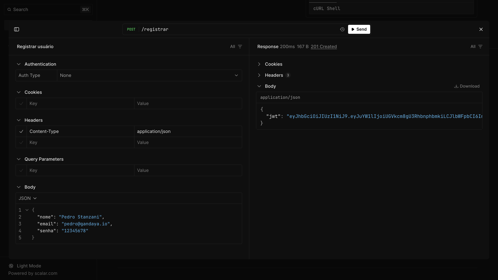
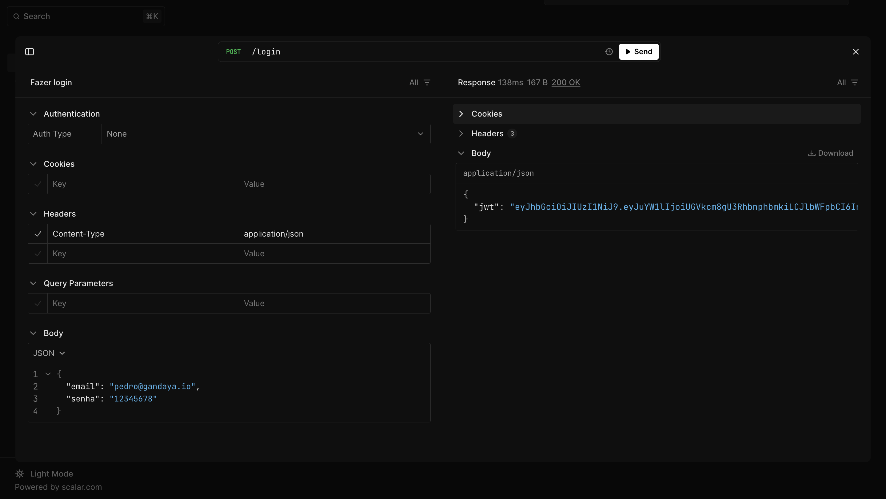
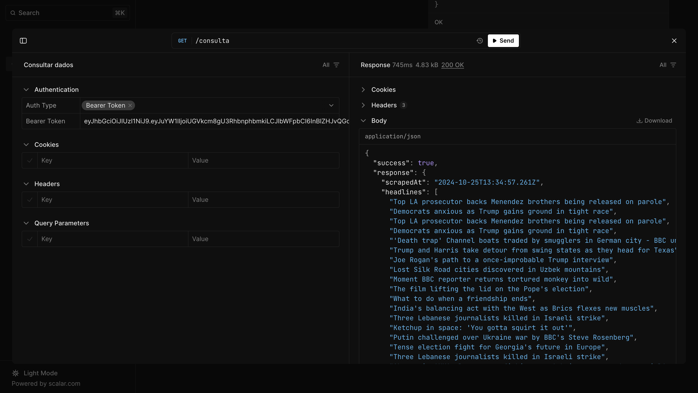

# JWT Authentication API

Aluno: Pedro Henrique Stanzani de Freitas

Arquivo `compose.yaml`: [link](https://raw.githubusercontent.com/pedrostanzani/jwt-auth-api/refs/heads/main/compose.yaml)

Vídeo de demonstração: [https://youtu.be/_45PC0K1840](https://youtu.be/_45PC0K1840)

Esse projeto foi desenvolvido para a disciplina de Computação em Nuvem e demonstra uma API de autenticação com JWTs (JSON Web Tokens) que foi desenvolvida com ElysiaJS, Bun e TypeScript.

## Estrutura

| Codebase     |       Descrição       |
| :----------- | :-------------------: |
| [app](app)   | ElysiaJS + Bun server |
| [docs](docs) | Nextra documentation  |

## Documentação

A documentação está disponível em [jwt-auth-cloud.vercel.app](https://jwt-auth-cloud.vercel.app/).

## Docker Hub

A imagem do servidor ElysiaJS foi publicada no Docker Hub e está disponível [neste link](https://hub.docker.com/repository/docker/pedrostanzani/jwt-auth-api/general).

## Tecnologias utilizadas

Foram utilizadas as seguintes tecnologias:

- ElysiaJS: framework para construir servidores web
- Bun: runtime de JavaScript e package manager
- TypeScript: linguagem de programação com tipagem estática
- Prisma: ORM para Node.js e TypeScript

E as seguintes bibliotecas foram utilizadas para desenvolver o serviço de web scraping:

- Cheerio: biblioteca para parsing de HTML
- Axios: cliente HTTP para fazer requisições web

## Explicação do scraping

O endpoint de consulta retorna uma lista de manchetes da BBC. Essas manchetes são armazenadas em cache (memória) e atualizam de hora em hora.

Para realizar o scraping, uma requisição HTTP é realizada ao site da BBC. O payload dessa requisição passa por um parsing com funções da biblioteca Cheerio. Consulte o código do [serviço de Scraping](./app/src/services.ts) para saber mais.


## Execução da aplicação

Siga as seguintes instruções para instalar e executar o projeto.

1. Faça o download do arquivo [compose.yaml](https://raw.githubusercontent.com/pedrostanzani/jwt-auth-api/refs/heads/main/compose.yaml) e armazene-o em um diretório vazio.

2. Execute o comando abaixo no terminal do diretório em que o arquivo compose.yaml foi armazenado:
  ```bash
  docker compose up
  ```

3. Agora você pode acessar a API em [http://localhost:3000](http://localhost:3000).


## Screenshots dos endpoints testados

- Cadastro de usuários
  

- Login de usuários
  

- Consulta de dados
  