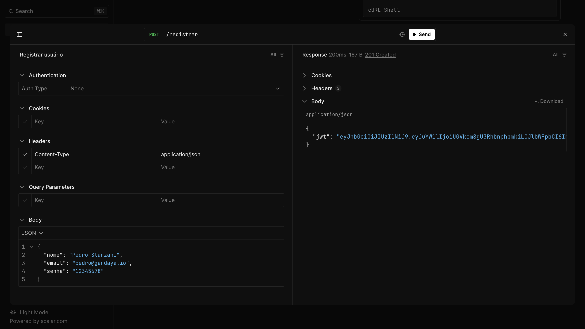
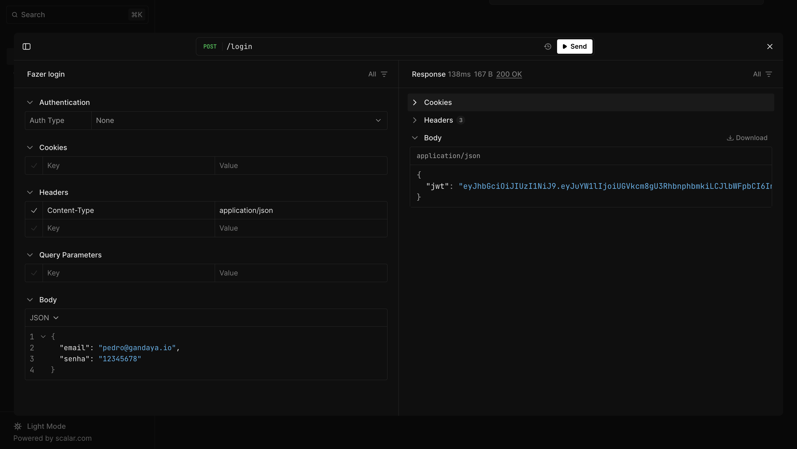
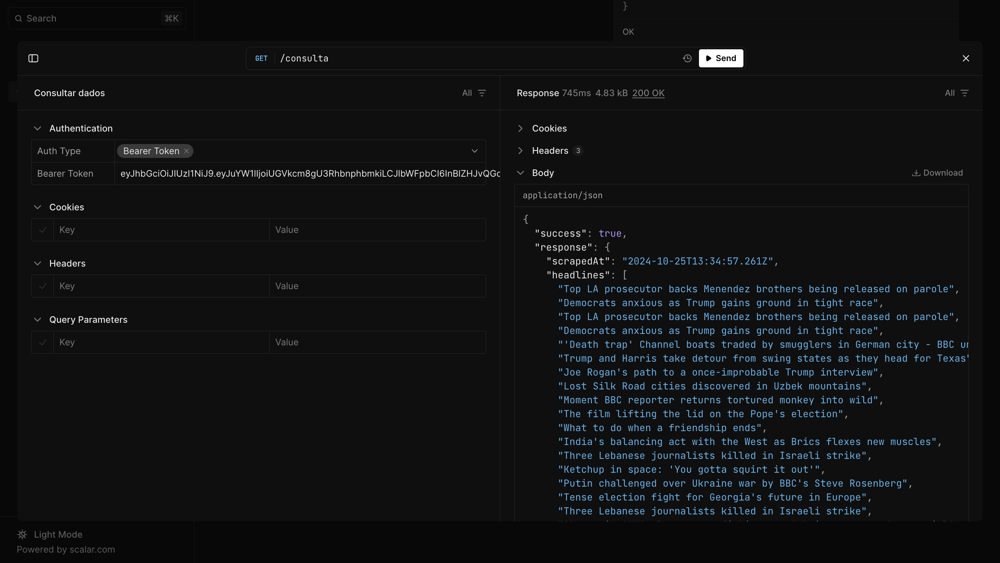

# JWT Authentication API

> [!INFO]
> This project was developed for the "Cloud Computing" class I took at Insper, in late 2024. Documentation has since been translated from Portuguese to English.

> [!TIP]
> Check out the demo video (in Portuguese): [https://youtu.be/\_45PC0K1840](https://youtu.be/_45PC0K1840)

## About

This is an authentication API that lets users register, login, and access protected content using JWT tokens. It includes a web scraper that fetches BBC headlines and caches them for one hour. It uses PostgreSQL to store user data. Docker was used to containerize the application.

## 🚀 Quickstart

Running this project is as easy as downloading the [`compose.yaml`](https://raw.githubusercontent.com/pedrostanzani/jwt-auth-api/refs/heads/main/compose.yaml) file and running `docker compose up`. The ElysiaJS server has been published to Docker Hub as a [pre-built image](https://hub.docker.com/repository/docker/pedrostanzani/jwt-auth-api/general), so no local compilation is required.

## Architecture

This project consists of:

- `api`: ElysiaJS API server to handle authentication and scraping.
- `db`: PostgreSQL database to store user credentials.

## Structure

| Codebase     |      Description      |
| :----------- | :-------------------: |
| [app](app)   | ElysiaJS + Bun server |
| [docs](docs) | Nextra documentation  |

## API Endpoints

### Authentication

#### POST `/registrar` - User Registration

- **Body**: `{ nome: string, email: string, senha: string }`
- **Response**: `{ jwt: string }` (201) or `{ error: string }` (409/422)
- **Description**: Register a new user and receive a JWT token

#### POST `/login` - User Login

- **Body**: `{ email: string, senha: string }`
- **Response**: `{ jwt: string }` (200) or `{ error: string }` (401/422)
- **Description**: Authenticate user and receive a JWT token

#### GET `/consulta` - Data Query

- **Headers**: `Authorization: Bearer <jwt_token>`
- **Response**: `{ success: boolean, response: { scrapedAt: string, headlines: string[] } }`
- **Description**: Fetch BBC headlines (requires authentication)

## Technologies Used

The following technologies were used:

- **ElysiaJS**: Framework for building web servers
- **Bun**: JavaScript runtime and package manager
- **TypeScript**: Programming language with static typing
- **Prisma**: ORM for Node.js and TypeScript
- **PostgreSQL**: Relational database for user storage

And the following libraries were used to develop the web scraping service:

- **Cheerio**: Library for HTML parsing
- **Axios**: HTTP client for making web requests

## Environment Variables

| Variable            | Default                                                            | Description                     |
| ------------------- | ------------------------------------------------------------------ | ------------------------------- |
| `POSTGRES_USER`     | `postgres`                                                         | Database username               |
| `POSTGRES_PASSWORD` | `postgres`                                                         | Database password               |
| `POSTGRES_DB`       | `postgres`                                                         | Database name                   |
| `DATABASE_URL`      | `postgres://postgres:postgres@db:5432/postgres`                    | Full database connection string |
| `JWT_SECRET`        | `fbb15a424da0317fada92aca9512af0520f4f556cc0a96e12a9711324f45f350` | Secret key for JWT signing      |

## Testing the API

### 1. Register a new user

```bash
curl -X POST http://localhost:3000/registrar \
  -H "Content-Type: application/json" \
  -d '{"nome":"John Doe","email":"john@example.com","senha":"password123"}'
```

### 2. Login

```bash
curl -X POST http://localhost:3000/login \
  -H "Content-Type: application/json" \
  -d '{"email":"john@example.com","senha":"password123"}'
```

### 3. Access protected data

```bash
curl -X GET http://localhost:3000/consulta \
  -H "Authorization: Bearer YOUR_JWT_TOKEN"
```

## Scraping Explanation

The query endpoint returns a list of BBC headlines. These headlines are stored in cache (memory) and update every hour.

To perform the scraping, an HTTP request is made to the BBC website. The payload of this request goes through parsing with Cheerio library functions. Check the [Scraping service](./app/src/services.ts) code to learn more.

## Running the Application

Follow these instructions to install and run the project.

1. Download the [compose.yaml](https://raw.githubusercontent.com/pedrostanzani/jwt-auth-api/refs/heads/main/compose.yaml) file and store it in an empty directory.

2. Run the command below in the terminal of the directory where the compose.yaml file was stored:

```bash
docker compose up
```

3. Now you can access the API at [http://localhost:3000](http://localhost:3000).

## Development

### Local Development

1. Clone the repository
2. Run `bun install` in the `app` directory
3. Set up environment variables
4. Run `bun run dev` for development server

### Building the Docker Image

```bash
cd app
docker build -t your-username/jwt-auth-api .
```

## Troubleshooting

### Database Connection Issues

- Ensure PostgreSQL container is running: `docker ps`
- Check database logs: `docker logs database`

### JWT Token Issues

- Verify JWT_SECRET is set correctly
- Check token expiration (default: 1 hour)

### Scraping Issues

- BBC website structure may change, check scraper service logs
- Cache refreshes every hour automatically

## Documentation

The comprehensive documentation is available at [jwt-auth-cloud.vercel.app](https://jwt-auth-cloud.vercel.app/).

## Docker Hub

The ElysiaJS server image was published on Docker Hub and is available at [this link](https://hub.docker.com/repository/docker/pedrostanzani/jwt-auth-api/general).

## Screenshots of Tested Endpoints

### User Registration


_Testing user registration with valid credentials_

### User Login


_Testing user authentication and JWT token generation_

### Data Query


_Testing protected endpoint with JWT authentication_
